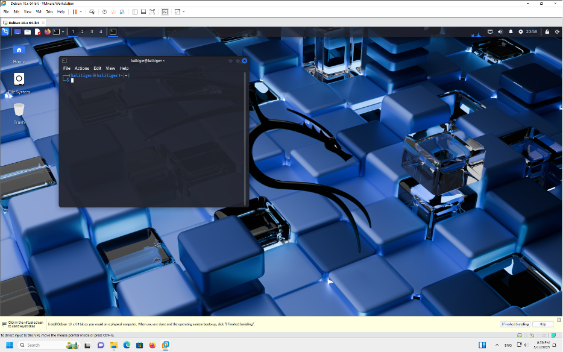
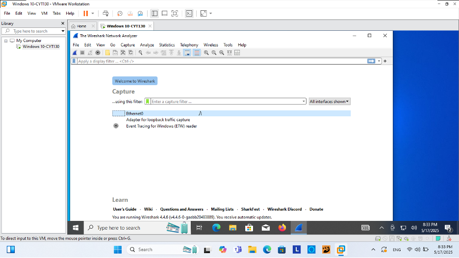
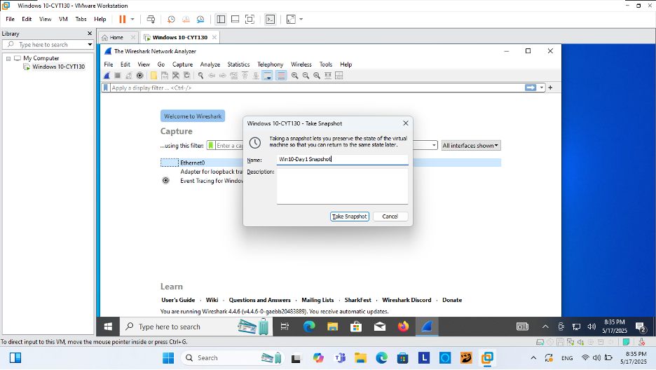

#  Enterprise IT Infrastructure Lab (SOC + Offensive Testing)

<p align="center">
  
  
  
  
</p>

---

##  Overview

This project simulates a **real-world enterprise IT environment** designed for:

- System deployment and configuration  
- Network troubleshooting and diagnostics  
- Endpoint monitoring and issue resolution  
- Security testing and SOC-based detection workflows  

 Built to reflect **real IT operations and field service environments**, not isolated lab exercises.

---

##  Objective

Develop hands-on experience in:

- Diagnosing and resolving system and network issues  
- Managing endpoint environments (Windows/Linux)  
- Performing root cause analysis using logs and system data  
- Supporting security monitoring and incident investigation workflows  

---

##  Architecture Diagram


##  Environment Setup

###  Systems Deployed

| System        | Role                          |
|--------------|------------------------------|
| Kali Linux   | Testing & Diagnostics System |
| Windows 10   | Endpoint / User System       |
| Virtual Net  | Internal Network Simulation  |

---

#  Kali Linux Configuration

##  Deployment

Kali Linux deployed as a **diagnostic and testing node** used for:

- Network testing  
- System validation  
- Controlled attack simulation  

---

##  System Validation



Verified OS functionality and environment readiness.

---


Executed validation commands:

```
uname -a
date
whoami
```

Ensured proper system configuration and operational stability.

---

##  Snapshot Management


Snapshot created to support:

- Rollback capability  
- Stable baseline  
- Repeatable scenarios  

---

#  Windows 10 Endpoint Configuration

##  Deployment

Windows 10 deployed as an **enterprise endpoint system** to simulate:

- User environment  
- Application usage  
- System-level troubleshooting scenarios  

---

##  Tool Installation



Wireshark installed for:

- Packet inspection  
- Network diagnostics  
- Traffic analysis  

---

##  Snapshot Management



Maintains a consistent baseline for testing and recovery.

---

#  IT Operations Use Cases

This lab enables real-world troubleshooting scenarios:

###  System & Endpoint
- OS configuration and validation  
- Performance troubleshooting  
- Application-level issue diagnosis  

###  Networking
- DNS resolution issues  
- IP misconfiguration  
- Connectivity failures  
- Network diagnostics using Ping / Tracert  

###  Authentication & Access
- Login failures  
- Account issues  
- System access troubleshooting  

###  Root Cause Analysis
- Log-based investigation  
- Cross-system issue correlation  
- Failure pattern identification  

---

#  Real-World Troubleshooting Scenario

##  Incident: Endpoint Unable to Access Network

###  Issue
A Windows 10 endpoint was unable to access internal and external network resources.

---

### 🔍 Initial Symptoms

- No internet connectivity  
- Unable to ping gateway  
- Applications failing to load  
- Network status showed "Unidentified Network"  

---

###  Investigation Steps

1. Checked IP configuration:
   ```
   ipconfig
   ```
   → No valid IP address assigned  

2. Tested connectivity:
   ```
   ping 8.8.8.8
   ```
   → Request timed out  

3. Verified network adapter  
   → Adapter enabled, no hardware issue  

4. Checked DHCP assignment  
   → No IP received from DHCP server  

---

###  Root Cause

DHCP failure prevented the system from obtaining a valid IP address, resulting in complete network disconnection.

---

###  Resolution

```
ipconfig /release
ipconfig /renew
```

- Restarted network adapter  
- Verified correct IP assignment  

---

###  Outcome

- Network connectivity restored  
- System successfully accessed internal and external resources  
- Issue resolved without escalation  

---

###  Skills Demonstrated

- Network troubleshooting  
- Endpoint diagnostics  
- Root cause analysis  
- Command-line troubleshooting  
- Incident resolution workflow  

---

#  Security & SOC Integration

This environment also supports:

- Attack simulation (brute force, scanning)  
- Threat detection and monitoring  
- SIEM integration (Splunk)  
- Incident investigation workflows  

---

#  Related Projects

- Enterprise Authentication Attack Detection (Splunk SIEM)  
- Credential Access Detection & Response (Defender XDR)  
- Threat Hunting & Detection Engineering Labs  

---

#  Key Takeaways

✔ Deploy and manage enterprise systems  
✔ Troubleshoot real-world IT issues  
✔ Diagnose network and endpoint problems  
✔ Perform root cause analysis using logs  
✔ Integrate security monitoring into operations  

---

##  Value for IT & SOC Roles

This lab highlights capabilities relevant to:

- IT Support / Field Services  
- System Administration  
- Network Troubleshooting  
- SOC Analyst / Security Operations  

---
